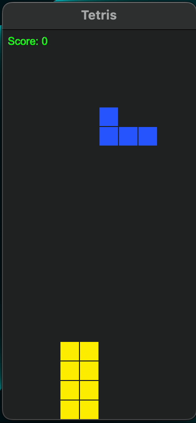

# tetris
A minimal Tetris game for macOS, in a Swift package. A port of the [Tetris example in the Vlang repository](https://github.com/vlang/v/tree/master/examples/tetris).

<picture>
  
</picture>


### Build & Run

```
swift run
```

### Install using [Mint](https://github.com/yonaskolb/Mint)

```
mint install frazer-rbsn/tetris
```

Then you can play it by using the `tetris` command in your terminal.

